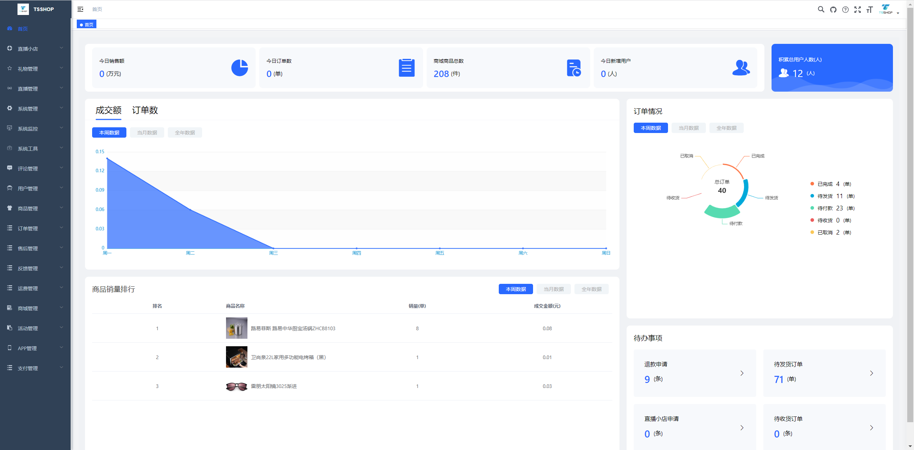
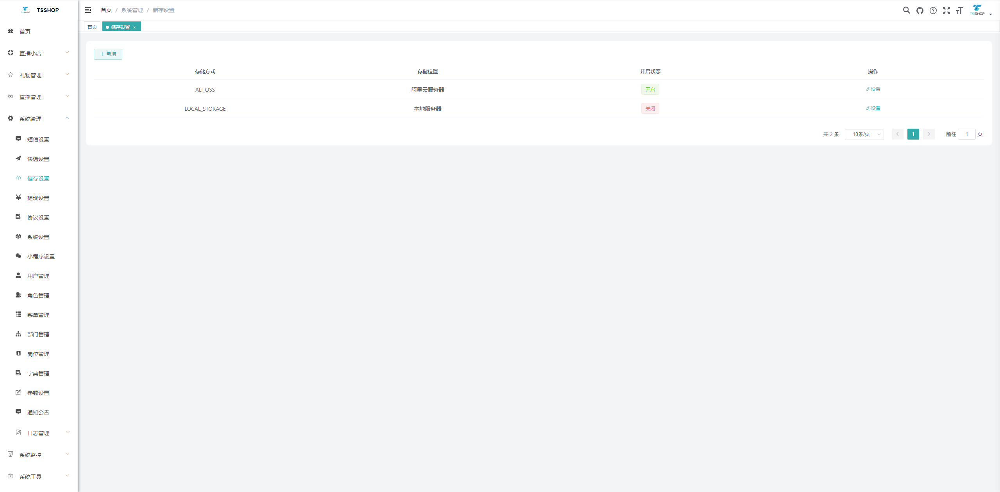

## TS SHOP
> `TS SHOP`项目致力于为中小企业打造一个完整、易于维护的开源的电商系统，采用现阶段流行技术实现，包含直播，小店，多种支付方式可自由在后台进行完整配置。后台管理系统包含商品管理、订单管理、直播管理、支付管理、权限管理、设置等模块。
## 前端仓库地址
https://github.com/tsshop/tsshop-uniapp
## 后端仓库地址
https://github.com/tsshop/tsshop-backend-web
## 运行条件
* Redis
* MySQL数据库
## 后台展示

## 配置项
* 在项目的初始化运行时需要再后台进行一些配置，详细配置信息如下：
* 存储配置    
> 支持本地存储和阿里云OSS存储。    

* 短信配置    
> 支持云极短信以及阿里大于短信。    

* 快递配置    
> 支持快递鸟在线配置。    

* 小程序配置    
> 项目包含小程序，如需使用需要在此配置。    

* 协议配置    
> 包含用户协议，隐私协议，支付协议，如需使用此功能，可直接在后台进行编辑。

* 系統配置     
> 系统运行自行设置LOGO，项目名称及系统默认头像（系统中需要的所有默认头像）

## 支付配置模块
* 支付方式 -> 支付接口 -> 支付通道
> 项目支持多种支付类型需在后台进行完整配置即可使用，目前支持支付宝APP、支付宝H5、微信小程序、微信APP、银联聚合支付，所有配置信息均可在后台完成配置。    
* 支付方式配置
> 配置支付的提供方（支付宝 云闪付 微信等）    

* 支付接口配置
> 配置支付需要的参数信息    

* 支付通道配置
> 选择支付接口，填写真实的支付参数 如需提现，可在支付通道自行选择开启或关闭   

## 技术架构
springboot + Mybatis-plus + Redis + MySQL
## 交流群
